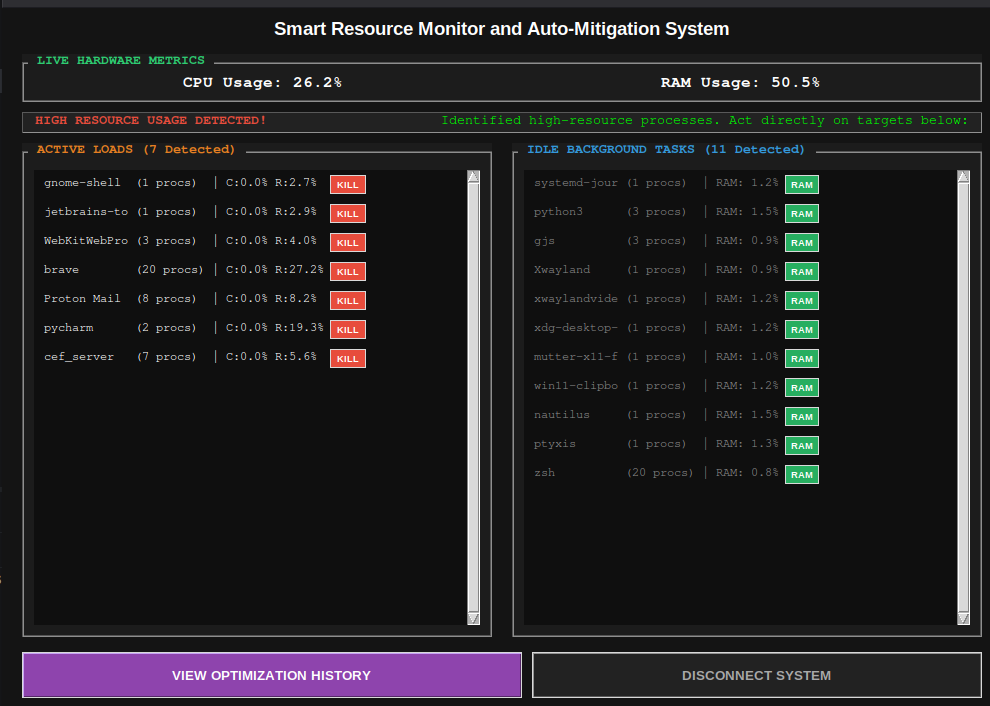
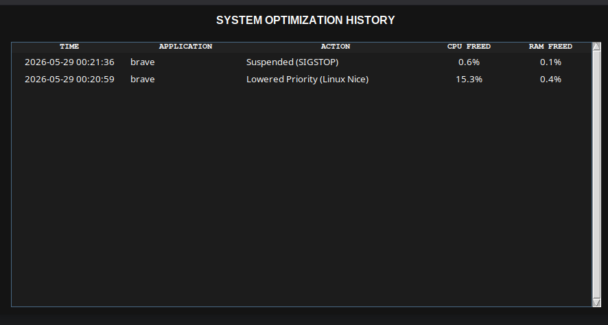

# ⚡ Smart Resource Monitor & Auto-Mitigation System

A lightweight, high-performance telemetry dashboard and auto-mitigation utility designed to track down resource hogs and reclaim system memory with surgical precision. 

Built with a clean, dark-themed interface, this tool goes beyond basic task management by automatically categorizing processes into **Active Loads** and **Idle Background Tasks**, allowing users to apply targeted mitigation strategies like process purging or memory trimming without destabilizing the system.

## 🚀 Features

* **Real-Time Telemetry:** Continuous monitoring of system-wide CPU and RAM utilization.
* **Smart Process Classification:**
  * 🔴 **Active Loads:** Identifies applications consuming excessive CPU (>1.5%) or RAM (>2.0%).
  * 🔵 **Idle Background Tasks:** Flags sleeper processes hoarding memory (>0.5% RAM) while using negligible CPU (≤0.1%).
* **One-Click Mitigation Strategies:**
  * **Purge (Kill):** Terminates heavy, non-essential process trees entirely to immediately free up compute power.
  * **Trim (Optimize):** Swaps out the idle working set of background tasks (Windows) or adjusts their nice value (Linux) to free up RAM without killing the application.
* **Optimization History & Logging:** All actions are logged to a local CSV, complete with timestamps, target PIDs, and exactly how much CPU/RAM was reclaimed. Viewable directly through the built-in History Dashboard.
* **Cross-Platform Compatibility:** Native support for Windows memory management APIs (`ctypes.windll.kernel32`) and Unix-based process prioritization.

## 📥 Installation & Usage

*(Note: Pre-compiled executable files for Windows and Linux are coming soon to the [Releases](#) page. You won't need Python installed to run them!)*

### Running from Source

1. **Clone the repository:**
   ```bash
   git clone [https://github.com/VISTRONA/smart-resource-monitor.git](https://github.com/VISTRONA/smart-resource-monitor.git)
   cd smart-resource-monitor
   ```
2. **Install dependencies:**
Ensure you have Python 3.x installed, then install the required psutil library.

    ```bash
    pip install -r requirements.txt
    ```
3. **Run the application:**

    ```bash
    python main.py
    ```

## ⚙️ How It Works (Under the Hood)
The monitor establishes a continuous heartbeat loop, fetching hardware metrics via psutil.
To ensure system stability, core OS processes (like System, Registry, explorer.exe, init) and
the monitor's own PID are strictly blacklisted from the mitigation targets.

When a Trim action is executed on Windows, the system accesses the process
handle via the kernel32 API and forces the OS to page out the application's
unneeded memory pages (SetProcessWorkingSetSize), instantly reducing its physical RAM footprint.
On Linux, it falls back to maximizing the process's nice value, de-prioritizing it on the CPU scheduler.

## 📸 Screenshots
### Live Dashboard

### History Dashboard


## 👨‍💻 Development Team
This project was engineered and developed by:
1. [VISTRONA](https://github.com/VISTRONA) 
2. [ars120407-commits](https://github.com/ars120407-commits)

## 🛡️ License

This project is open-source. Please feel free to fork, optimize, and submit pull requests.